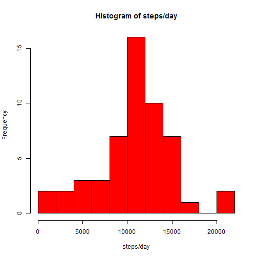
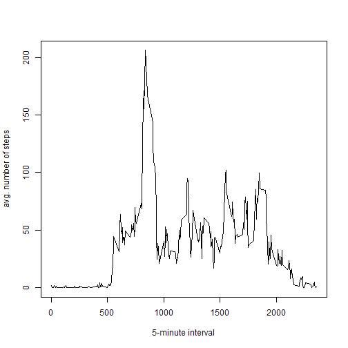
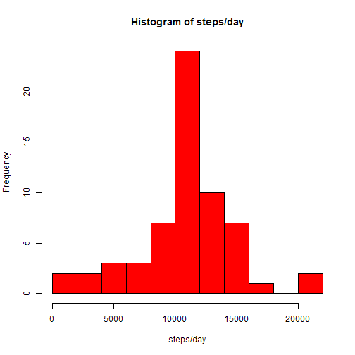
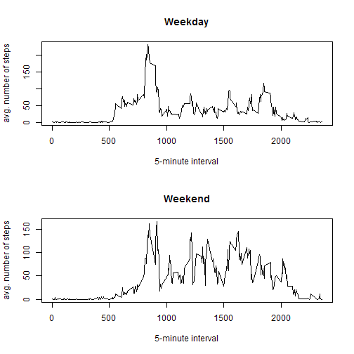

## Loading and preprocessing the data

Reads the file into a new variable: **d**

```r
d<-read.csv("D:/_DATA SCIENCE/05 - Reproducible Research/activity.csv")
summary(d)
```

```
##      steps                date          interval     
##  Min.   :  0.00   2012-10-01:  288   Min.   :   0.0  
##  1st Qu.:  0.00   2012-10-02:  288   1st Qu.: 588.8  
##  Median :  0.00   2012-10-03:  288   Median :1177.5  
##  Mean   : 37.38   2012-10-04:  288   Mean   :1177.5  
##  3rd Qu.: 12.00   2012-10-05:  288   3rd Qu.:1766.2  
##  Max.   :806.00   2012-10-06:  288   Max.   :2355.0  
##  NA's   :2304     (Other)   :15840
```

and removes the NA values

```r
d1 <- na.omit(d);
```

## What is mean total number of steps taken per day?

Calculates the sum of steps per day,

```r
sday <- aggregate(d1$steps, by=list(y=d1$date), FUN=sum, na.rm=TRUE)
```
plots a histogram,

```r
hist(sday$x,breaks=10,col="red",xlab="steps/day",main="Histogram of steps/day")
```

 

and calculates mean and median

```r
mean(sday$x)
```

```
## [1] 10766.19
```

```r
median(sday$x)
```

```
## [1] 10765
```


## What is the average daily activity pattern?

Calculates the average of steps per interval,

```r
sint <- aggregate(d1$steps, by=list(y=d1$interval), FUN=mean, na.rm=TRUE)
```

plots a time-series graph,

```r
plot(sint$y,sint$x,xlab="5-minute interval",ylab="avg. number of steps",type="l")
```

 

and finds the interval with the maximum average number of steps

```r
sint$y[which.max(sint$x)]
```

```
## [1] 835
```

## Imputing missing values

Calculates the number of missing values

```r
sum(is.na(d))
```

```
## [1] 2304
```

and replace them with the average value of the corresponding 5-minute interval (calculated in the previous paragraph)

```r
d2 <- d
for(i in 1:length(d2$steps)) 
{
  if(is.na(d2$steps[i]))
  {
    d2$steps[i]<-sint[sint$y==d2$interval[i],2]
  }
}
```

Calculates the sum of steps per day (now without NA values)

```r
sday2 <- aggregate(d2$steps, by=list(y=d2$date), FUN=sum, na.rm=TRUE)
```
plots a histogram

```r
hist(sday2$x,breaks=10,col="red",xlab="steps/day",main="Histogram of steps/day")
```

 

and calculates statistics

```r
mean(sday2$x)
```

```
## [1] 10766.19
```

```r
median(sday2$x)
```

```
## [1] 10766.19
```

The replacement of missing values with the average value of the corresponding 5-minute interval does not have a significative impact in the mean or median of the dataset.

## Are there differences in activity patterns between weekdays and weekends?

Now creates a new factor variable where it calculates if the date correspond to a weekend day ("sábado" or "domingo" in spanish)

```r
d2$wd <- factor(weekdays(as.Date(d2$date))=="sábado"|weekdays(as.Date(d2$date))=="domingo")
levels(d2$wd)[levels(d2$wd)==TRUE]<-"weekend"
levels(d2$wd)[levels(d2$wd)==FALSE]<-"weekday"
```

Calculates the average of steps per interval in each case

```r
d2wd = d2[d2$wd=="weekday",]
d2we = d2[d2$wd=="weekend",]
sint2wd <- aggregate(d2wd$steps, by=list(y=d2wd$interval), FUN=mean, na.rm=TRUE)
sint2we <- aggregate(d2we$steps, by=list(y=d2we$interval), FUN=mean, na.rm=TRUE)
```

and plots a time-series graph comparing weekend and weekdays

```r
par(mfrow=c(2,1))
plot(sint2wd$y,sint2wd$x,xlab="5-minute interval",ylab="avg. number of steps",type="l",main="Weekday")
plot(sint2we$y,sint2we$x,xlab="5-minute interval",ylab="avg. number of steps",type="l",main="Weekend")
```

 

During the week dasy, activity starts at aproximately 6:00 AM to have a peak at 8:35 and then falls dramatically. It remains quite low until 19:00 and then virtually disappears after 20:00. During the weekend, however, the number of steps remains very low until 8:00. There is a peak more or less at the same time than during week days, but there are similar values all along the central hours of the day until 20:30.
